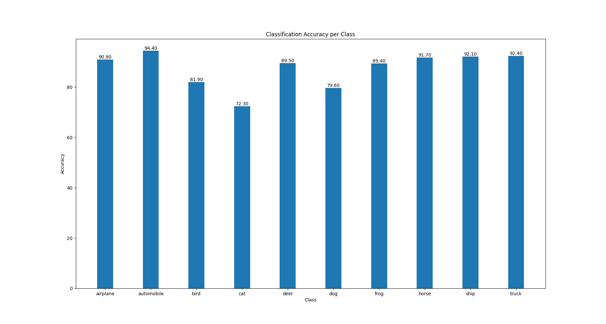
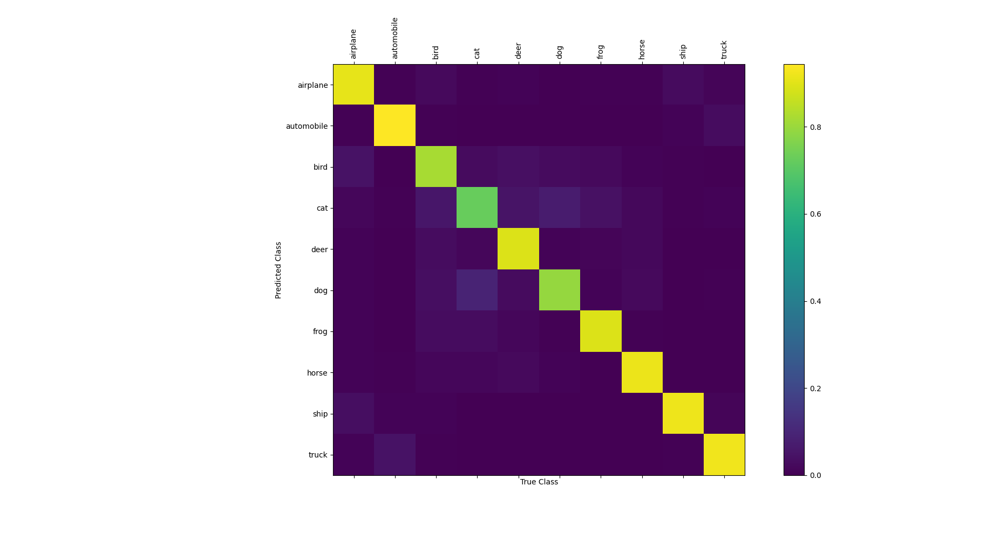

# CIFAR-10 Network
A Neural Network used to classify the images of the [CIFAR-10](https://www.cs.toronto.edu/~kriz/cifar.html) Dataset.
The Network is a deep convolutional network inspired by the ones described in [Very Deep Convolutional Networks for Large-Scale Image Recognition](https://arxiv.org/abs/1409.1556). It contains 4 set of Convolutional and Batch Normalization layers followed by an ReLU non-linearity and then a MaxPool layer. The particular thing about this network is that it uses kernels of size 3x3 for the convolutions, which is very small. The output of the Network is a class conditional probability for the 10 classes in the [CIFAR-10](https://www.cs.toronto.edu/~kriz/cifar.html) Dataset using a softmax non-linearity.

## Accuracy
The obtained classification accuracy obtained after 100 epochs is around 86%

A per class classification accuracy can be seen in the following plot:

In this next plot, which is the confusion matrix for our model given the classification task, we can notice that for example
the model confuses cats for dogs and dogs for cats sometimes and that in general it has a hard time with living creatures ( cats, dogs,
 birds, horses ... ) compared to other objects ( automobiles, airplanes, trucks and ships ).

