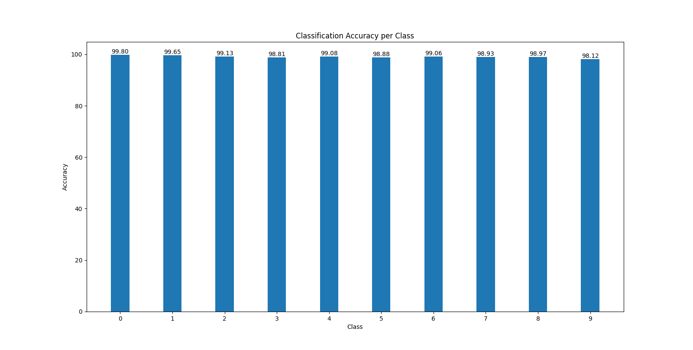
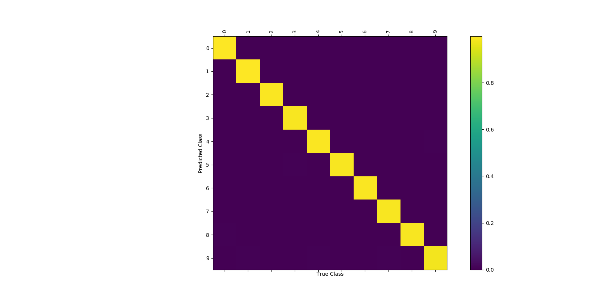

# MNIST Network
A Neural Network used to classify the images of the [MNIST](http://yann.lecun.com/exdb/mnist/) Dataset.
The Network is composed of two BLSTM layers and a Fully Connected layer.
The first BLSTM layer process the image in the horizontal direction, whereas the second one processes
it in the vertical direction. The Fully Connected layer takes the output of both layers and gives a class conditional probability
for the 10 classes in the [MNIST](http://yann.lecun.com/exdb/mnist/) Dataset.

## Accuracy
The obtained classification accuracy obtained after 1000 epochs is around 99%

A per class classification accuracy can be seen in the following plot:

The next plot is the confusion matrix for our model given the classification task:

