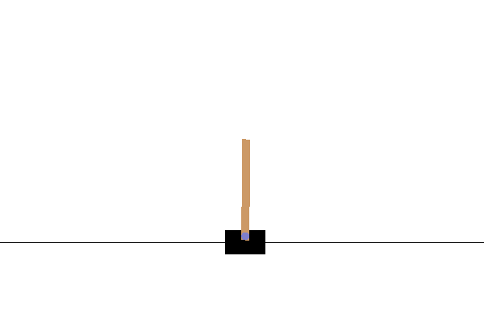

# CartPole

A Convolutional Neural Network for a modified version of the CartPole-v1 environment
trained using an improved version of the Deep Q Network (DQN) algorithm
as described in the [Rainbow](https://arxiv.org/abs/1710.02298) article.

The CartPole-v1 environment from the [OpenAI Gym](https://gym.openai.com/) library is wrapped
with different wrappers:
- [PixelObservationWrapper](https://github.com/openai/gym/blob/0.17.2/gym/wrappers/pixel_observation.py#L14) to get pixels
as current state's value
- [ResizePixelObservationWrapper](src/environment.py), custom environment, to resize the pixels from the previous
wrapper
- [FlattenObservation](https://github.com/openai/gym/blob/0.17.2/gym/wrappers/flatten_observation.py#L5) to flatten the pixels output from the previous wrapper as preparation for the
FrameStack wrapper
- [FrameStack](https://github.com/openai/gym/blob/0.17.2/gym/wrappers/frame_stack.py#L53) to stack a number of frames on top of each in order to use them as a single state.

After training, the model can manage to balance the pole for a bit:

