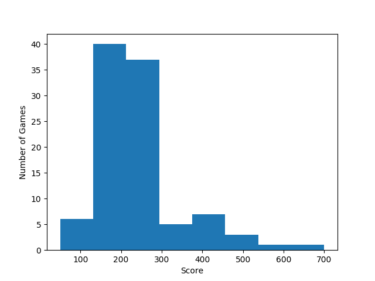

# Space Invaders
A Deep Q Network trained to play Space Invaders using [OpenAI Gym](https://gym.openai.com/).
It is mostly similar to the one described in this [PyTorch tutorial](https://pytorch.org/tutorials/intermediate/reinforcement_q_learning.html)
with a change to the optimization part that uses the equations from [Deep Reinforcement Learning with Double Q-learning](https://arxiv.org/abs/1509.06461)
and another change to the action policy, where we use a Bolzmann (softmax) exploration strategy instead of the more popular
ε-greedy exploration strategy.

After 900 episodes of training, the model can manage to score an average of 241 points and a max 700 points over 100 games:

