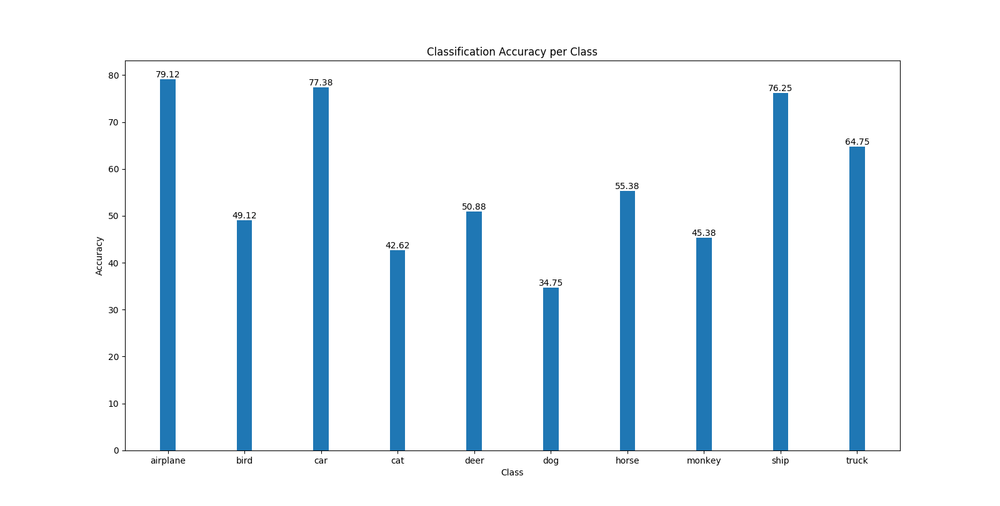
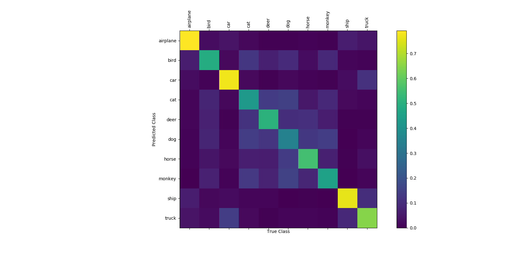

# STL-10 Network
A Neural Network used to classify the images of the [STL-10](http://ai.stanford.edu/~acoates/stl10/) Dataset.
The Network is a deep convolutional network inspired by the ones described in [Stacked What-Where Auto-encoders](https://arxiv.org/abs/1506.02351).
It contains 2 sets of Convolutional and Batch Normalization layers, 2 sets of Deconvolutional and Batch Normalization layers.
Each set is followed by an ReLU non-linearity and then a MaxPool layer for the former 2 and MaxUnPool for the latter 2.
Additionally, the former sets are followed by 3 Fully Connected layers each followed by a non-linearity ReLU for the first 2
and softmax for the last to output the class conditionaly probability for the 10 classes in the [STL-10](http://ai.stanford.edu/~acoates/stl10/) Dataset.
The particular thing about this network is that be used for supervised learning, unsupervised learning as well as semi-supervised learning through the use
of different losses.

## Accuracy
The obtained classification accuracy obtained after 100 epochs is around 57%

A per class classification accuracy can be seen in the following plot:

In this next plot we can see the confusion matrix for our model given the classification task:

